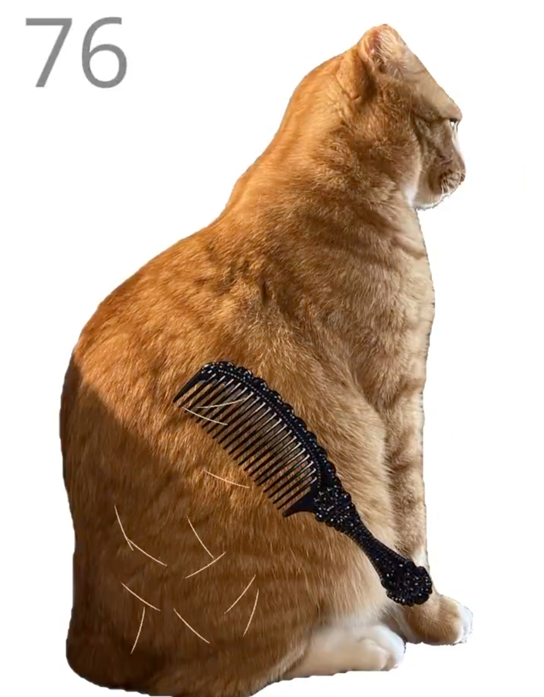

# 🐱 Brush Jjaemu — Play Online (Free, No Download)

> Most people think they have fast reflexes.  
> **This orange cat disagrees.**

---

## 🎮 Play Brush Jjaemu Online  

👉 **Instant Preview:** https://cherryyan1987.github.io/brush-jjaemu/  
👉 **Full Game:** https://brushjjaemu.live  

No download. No signup. Just you, a hairbrush… and a very unpredictable cat.

---

## 🐾 What Is Brush Jjaemu?

Brush Jjaemu is a viral cat grooming reflex game where your goal is simple:

- Pick up the hairbrush  
- Brush the orange cat  
- Stop instantly before it turns  

Miss the timing… and you get bitten. Game over.

Originally created by **artbyeori (byeorisim on itch.io)**, the game quickly spread across the internet.

Some players search for **brush jaime** — same game, same chaos.

---

## 🚀 Play Now (No Download)

You can play Brush Jjaemu instantly in your browser:

👉 https://brushjjaemu.live  

No installation. No signup. Just pure reflex challenge.

---

## ⚡ Why This Game Is Addictive

- Simple but brutally difficult  
- Instant reaction challenge  
- Unexpected jumpscare moments  
- “One more try” loop  

Think *Red Light, Green Light* — but with a chaotic orange cat.

---

## 🕹️ How to Play

1. Click or tap to pick up the brush  
2. Keep brushing to earn points  
3. Watch the cat carefully  
4. STOP immediately when it turns  

---

## 💡 Pro Tips

- Don’t get greedy  
- Short strokes are safer  
- Watch the cat’s signals  
- Timing > speed  

---

## ❓ FAQ

**Is Brush Jjaemu free?**  
Yes — you can play it online for free.

**Can I play on mobile?**  
Yes — works on phone, tablet, and desktop.

**Is Brush Jaime the same game?**  
Yes — it's a common misspelling of Brush Jjaemu.

---

## 🔗 Links

- ▶ Play Online: https://brushjjaemu.live  
- 🌐 Preview Page: https://cherryyan1987.github.io/brush-jjaemu/  

---

> Same game. Same orange cat. Just faster access.
